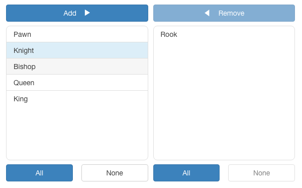

# angular2-dual-listbox

The dual-listbox supplies two lists side-by-side that allows items in one
list to be moved to the other list via drag-and-drop and/or a button-based
interface. It supports multiple select options from the list and programatic
setting of list sources.

The dual-listbox consists of a single file: (`app/dual-list.component.ts`)
and can be used in conjuction with Bootstrap and the provided CSS style 
sheet (`css/record-picker.css`) for presentation.



## Demo

A [working demo](http://czeckd.github.io/angular2-dual-listbox/demo/) shows
the dual listbox in action.


## Usage

Copy `dual-list.component.ts` into your app and add ``DualListComponent`` to 
the desired component's directives array. Additionally, add the 
`record-picker.css` to your app's `index.html`.  See `index.html` for an 
example.

The following parameters can be set on a dual-list: 
- **key** - The unique identifier field of each object in the `source` and 
`destination` arrays, default is ``_id``.
- **display** - The field of each object for displaying the object each the
lists, default is ``_name``.
- **height** - The height of the lists, default is ``100px``.
- **filter** - A boolean whether or not to display a filter for the lists,
default is ``false``.
- **sort** - A boolean whether or not to keep the lists sorted, default is 
``false``.
- **compare** - A compare function to be used for sorting the lists. Note if
sort is not set and compare is set, then sort will be set ``true``.
- **source** - The source array of objects for the list.
- **destination** The destination array of objects selected from the list.
Note, the ``destination`` array can have prexisting elements.

For a usage example, see `demo-app.component.ts`. 

### Known issue

The drag-and-drop between multiple dual-listbox components may cause 
undesired moves. For the time being, if the component is used, then it
is recommended only have one dual-listbox visable to the user at a time.


### Getting started

1. Clone this repo
1. Install the dependencies:
	```
    npm install
	```
1. Run the TypeScript transpiler and start the server:
	```
	npm start
	```

## License

MIT


## Author
- David Czeck [@czeckd](https://github.com/czeckd)
